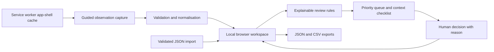

# Architecture

## Modules

| Module | Responsibility |
|---|---|
| `engine.js` | Pure record normalisation, validation, policy validation, review priority, duplicate candidates, attributed decisions, import and export. |
| `data.js` | Sixteen explicit synthetic training scenarios. |
| `app.js` | Four views, form draft, local storage, optional photo resize, search, review dialog and downloads. |
| `styles.css` | Responsive visual system, visible keyboard focus, reduced motion and accessible typography. |
| `sw.js` | Versioned application-shell caching and same-origin offline fallback. |
| `server.js` | Dependency-free development server. Production can use any static host. |

## Record contract

Each record contains an ID, data origin, site, observation timestamp, observer alias, appearance, odour, rain context, optional signs, optional readings with known units, method, instrument reference, calibration state, notes, evidence reference, review status and review history. Photos are local JPEG data URLs. Derived assessment is recomputed from raw observations and the current policy; it is exported with the policy version for reproducibility.

Persistence uses `streamlens-workspace-v1` and `streamlens-draft-v1` localStorage keys. The workspace is loaded only after validating records and settings. Failed persistence produces a session-only warning. Imports validate the entire bundle before adding any record. Existing IDs are retained rather than overwritten.

## Trust boundaries

Input text is escaped before DOM rendering. Imported IDs accept a bounded safe character set; review history, dates and enumerations are checked. CSV neutralises formula prefixes. Imported image payloads are discarded. The app makes no API calls, uses no analytics and loads no external fonts or maps. Source links open only when the user chooses them.

Local browser storage is visible to anyone with access to that browser profile; it is not encrypted. This version is for one-device workflows. It does not enforce multi-user access control, verify reviewer identities or detect deliberate local data changes.

## Offline behaviour

The service worker caches the application shell on first successful load. On later visits it fetches same-origin assets online and falls back to the cache when offline. Form capture, review, local drafts and downloads do not require network access. External reference pages need a connection. Installation and caching require HTTPS or localhost.
